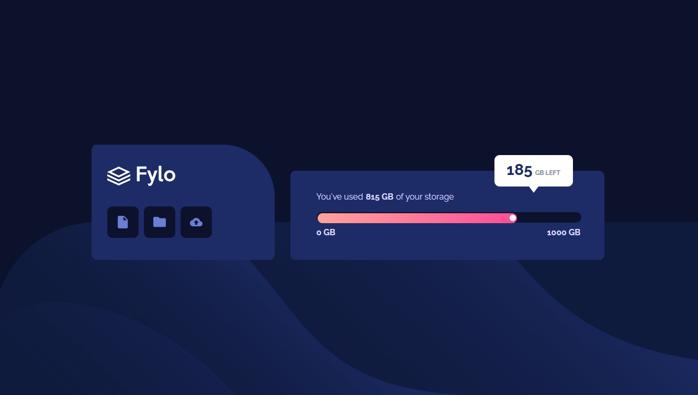
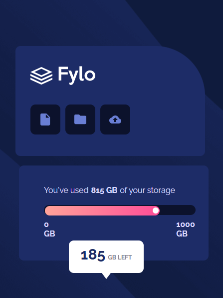

## Overview
This project is a responsive recreation of the Fylo Data Storage Component from Frontend Mentor. It displays the amount of storage a user has used and the amount of storage remaining, with a visual progress bar to represent the storage usage.

The project was built using HTML and CSS, with a focus on Flexbox, responsive design, positioning, and media queries.

### The challenge
The challenge was to build a responsive Fylo Data Storage Component that closely matches the provided design. The component needed to display the storage information, progress bar, and remaining storage notification while adapting to different screen sizes, including desktop and mobile devices.

### Screenshot

- Desktop: 

- Mobile: 

### Links
- Solution URL: 
- Live Site URL: 

### Built with
- HTML5
- CSS3
- Flexbox
- CSS Media Queries
- Responsive Design

## Author
- Frontend Mentor - Aisha Adeyemo (https://www.frontendmentor.io/profile/echo-script0)

- GitHub - https://github.com/echo-script0

